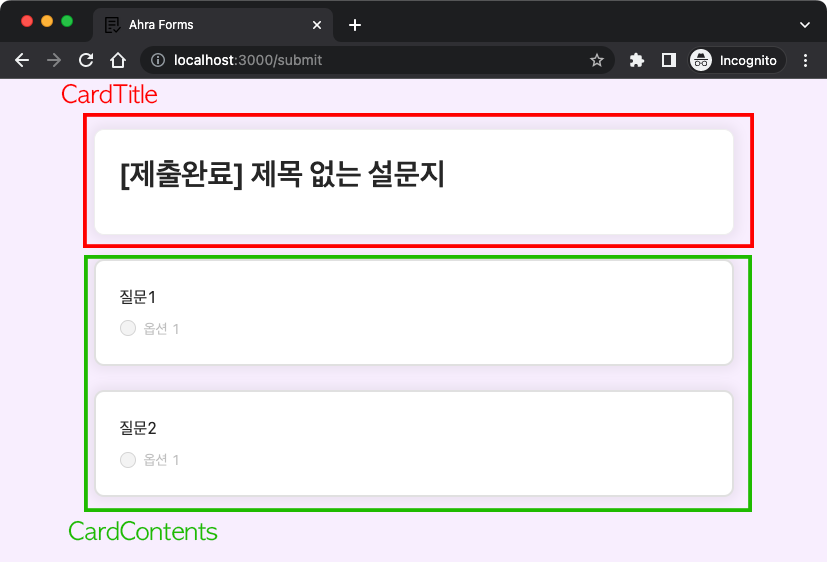

# Ahra Forms

Google Forms를 클론한 프로젝트입니다.

## 사용 기술
- `React`, `JavaScript`, `Redux Toolkit`, `React Router`, `Ant Design`
- 반응형 디자인

## 과제 설명
Ahra Forms는 크게 세 페이지로 나뉘어 있습니다.

### 1. Admin Page

- 폼의 제목, 설명, 질문을 수정할 수 있는 페이지입니다.
- 제목 카드 또는 질문 카드를 누르면 focus가 설정됩니다. (보라색 테두리)
- 제목 카드에 focus가 설정되었을 시 할 수 있는 것들
  - 폼 제목 편집
  - 폼 설명 편집
  - 질문 추가
- 질문 카드에 focus가 설정되었을 시 할 수 있는 것들
  - 질문 제목 편집
  - 질문 추가/복사/삭제
  - 질문 필수여부 설정
  - 질문 유형 설정
  - 질문 카드 상단에 이동 핸들이 나타나며, 이를 드래그&드롭해 질문 카드 순서를 변경할 수 있습니다.
- '미리보기' 버튼을 누르면 Preview Page로 이동합니다.
- '더미 데이터 채우기' 버튼을 누르면 모든 유형의 질문이 추가됩니다.

### 2. Preview Page

- Admin Page에서 작성된 폼을 작성자 입장에서 볼 수 있는 페이지입니다.
- '제출' 버튼을 누르면 Submit Page로 이동합니다.
  - '필수항목'인데 작성/선택하지 않은 경우 에러로 표시되며, Submit Page로 이동되지 않습니다.
- '뒤로 가기' 버튼을 누르면 Admin Page로 이동합니다.
- '양식 지우기' 버튼을 누르면 모달창이 뜨며, OK를 누르면 작성한 내용이 모두 삭제됩니다.
- '객관식 질문' 유형이면서 필수가 아닌 질문은 라디오 버튼 선택시 '선택해제' 버튼이 등장합니다.
- '기타' 옵션이 있는 경우 기타 옆의 input 창에 내용을 작성할 시 '기타'가 자동으로 선택됩니다.

### 3. Submit Page
- Preview Page에서 사용자가 폼을 작성한 대로 제출 내용을 보여주는 페이지입니다.

## 컴포넌트 구성

### 1. Admin Page

### 2. Preview Page

### 3. Submit Page

## 실행 방법

1. `npm install`

프로젝트 실행에 필요한 패키지 파일들을 다운로드 받습니다.

2. `npm start`

프로젝트를 실행합니다.

http://localhost:3000/ 로 접속할 수 있습니다.
- [Admin Page](http://localhost:3000/)
- [Preview Page](http://localhost:3000/preview)
- [Submit Page](http://localhost:3000/submit)